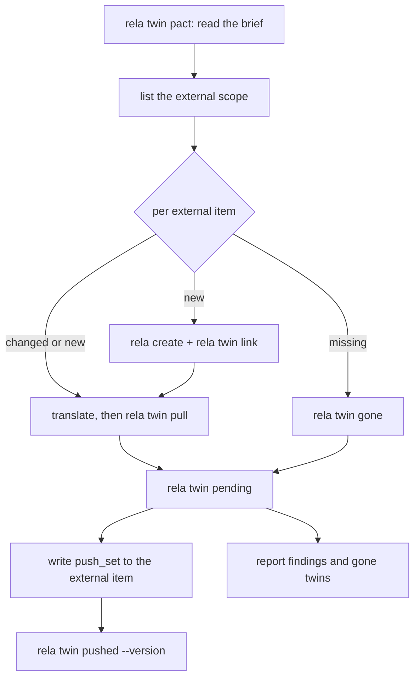

A **twin** is an entity's counterpart in another system: the Basecamp todo
behind a scenario, the GitHub issue behind a ticket. The **pact** is the
contract between an entity type and that system: which fields the other side
owns, which both sides edit, and how the two map onto each other.

rela never talks to the other system. An **agent** does: a program or an AI
assistant with its own credentials and tools, which reads the external item,
translates it into rela's fields, and hands the result to `rela twin`. rela
holds the pact, every twin, and the values both sides agreed on at the last
sync. It enforces field ownership on every write path it controls.

Integration = pacts + twins. This guide covers both, the loop an agent runs,
what each state and finding means, and exactly where ownership is enforced.

## Why integration is part of the schema

When a team decides that "the scenario's status is whatever the Basecamp todo
says", that is a statement about the data, not about a script. It belongs where
the rest of the data's rules live, for three reasons:

- **It can be enforced.** A rule in `schema.yaml` reaches every writer: the web
  app, the CLI, MCP, scripts, webhooks, CalDAV. A rule that lives inside a sync
  script only binds that script, and the first person who edits the field in
  the web app silently loses their edit on the next sync.
- **It can be reviewed.** The pact sits next to the properties it governs, so a
  reviewer sees which fields rela no longer owns when the change is proposed.
- **It survives the agent.** The agreed base of the last sync lives in rela, so
  a sync that crashes, an agent that is replaced, or a run on another day
  starts from the same facts.

### Why rela never calls the external system

The transport is the part of an integration that changes most and generalizes
least: authentication, API versions, pagination, rate limits, retries, and the
translation itself (Basecamp's rich-text HTML to markdown, a workflow's column
names to your enum). An agent handles all of that well and differently for
every system. rela handles none of it.

That split has consequences worth stating:

- **rela holds no credentials for external systems.** There is nothing to leak
  and nothing to rotate on the rela side.
- **An external outage never blocks a rela write.** rela does not wait on
  another system's API.
- **rela only knows its own side.** It can tell the agent what changed in rela,
  but not what changed in Basecamp. Discovering new, changed and deleted
  external items is the agent's job (see [the agent loop](#the-agent-loop)).
- **Nothing happens on its own.** There is no background sync, no polling and
  no webhook receiver for twins. Something has to run the agent.

## Declaring a pact

A pact is declared per entity type, under `pacts:`, keyed by a **system id**:

```yaml
entities:
  scenario:
    label: Scenario
    properties:
      title: {type: string, required: true}
      status: {type: enum, values: [open, done]}
      due: {type: date}
    pacts:
      basecamp:
        scope: https://app.basecamp.com/5734045/buckets/35926565/todolists/10075319677
        theirs: ["*"]
        shared: []
        propose: []
        instructions: |
          A Scenario is one todo in the scope todolist. ...
```

| Key | Meaning |
|---|---|
| system id (the map key) | Names the external system in every `rela twin` command. `^[a-z][a-z0-9_-]{0,31}$` |
| `scope` | Required. The http(s) URL of the external container the pact covers: a todolist, a repository, a project |
| `theirs` | Fields the external system owns. `["*"]` hands it every field |
| `shared` | Fields both sides edit. Concurrent different edits become a conflict |
| `propose` | Ours fields where an external edit is a proposal to review, not a mistake to revert |
| `instructions` | Optional markdown: how the two sides map. This is the agent's brief |

A **field** is a declared property name of the type, or the reserved name
`body` for the markdown content. Every field not named in `theirs` or `shared`
is **ours**: rela owns it. Relations are not fields.

One type can have pacts with several systems. An entity has at most one live
twin per system.

The pact is part of the entity type's definition. It moves with the type into
an included file, and `rela rename` of the type carries it along.

### Load-time checks

A bad pact fails the whole schema load, like a bad `comments:` block. A pact
that half-applied would enforce the wrong ownership: rela would revert edits
the other side was meant to own, or let through edits it was meant to guard.
The loader reports every problem it finds, with a "did you mean" hint for a
near-miss field name. It rejects a pact that:

- contains an unknown key (a misspelled `shraed:` would otherwise load as "that
  field is ours" and rela would quietly revert the other side's edits to it);
- has a system id that does not match the pattern above;
- has no `scope`, or a `scope` that is not an absolute http(s) URL;
- names a field that is neither a property of the type nor `body`;
- names a **computed** property in `theirs`, `shared` or `propose` (rela derives
  it, so no other side can edit it);
- uses `"*"` anywhere but `theirs`, or mixes `"*"` with named fields;
- has a non-empty `shared` next to `theirs: ["*"]` (every field is already
  theirs);
- puts one field in both `theirs` and `shared`, or twice in one list (a field has
  one owner);
- lists in `propose` a field that is not ours: a `theirs` or `shared` field, or
  any field when `theirs` is `["*"]`, or a field twice.

Two entity-level rules apply as well:

- A type that declares a property literally named `body` cannot declare pacts,
  because `body` would be ambiguous.
- A type that declares `faces:` cannot declare pacts yet.

`theirs: ["*"]` means every field **except computed properties**. A computed
property is always ours: rela recomputes it after every write, including a sync
write, and never compares it with the other side.

### Where the pact is visible

- `rela twin pact <entity-type> <system>` prints the whole pact, including
  `instructions`. It is the command an agent runs to read its brief.
- `/api/v1/_schema` lists each type's pacts as
  `[{system, scope, theirs, shared, propose}]`. `instructions` is left out of
  the schema response; the CLI prints it.

With no `pacts:` anywhere in the schema, twins do not exist: the `_twins` API
route answers 404, no ownership is checked, and no storage is created.

## Ownership: ours, theirs, shared

| Owner | Edited in rela | Edited externally | What a pull does |
|---|---|---|---|
| **theirs** | Refused on every gated path (see below) | Yes | Writes the external value into rela |
| **ours** | Yes | Reported as a `foreign_edit` finding | Never writes; rela's value stands |
| **shared** | Yes | Yes | Takes whichever side changed; both changed differently is a `conflict` |

**Theirs** is the only owner rela enforces on its own side. Ours and shared
fields remain ordinary rela fields; what differs is what a pull does with the
other side's value.

### Where ownership is enforced

A change to a **theirs** field of an entity with a live twin is refused on:

- `rela update`, `rela attach`, `rela detach` and the other CLI commands that
  edit an entity through rela (the store-level maintenance commands listed
  [below](#where-it-is-not) are the exception);
- the data-entry app and the `/api/v1` write routes (HTTP 422);
- MCP tools;
- Lua script writes, including automation **script** actions (they write
  through the same checked path);
- inbound webhooks (`/hooks/{id}`);
- CalDAV writes;
- elevated handles (`allow_acl_bypass:`). Bypassing the ACL does not bypass
  ownership.

Three writes that do not look like field edits are checked too:

- **A copy into an existing entity** (a [`copies:`](metamodel.md#declaring-copies)
  definition invoked with a `target_id` naming an entity that already exists)
  is refused when it would change a theirs field of a twinned target. Nothing
  is written. A copy that creates its target is not affected: the new entity
  has no twin yet.
- **An attachment** upload or delete on a `file` property that a twin owns
  (by name, or through `theirs: ["*"]`) is refused before any file changes,
  even when the upload keeps the old file name. The property and its files
  stay as they were.
- **Resolving a git merge conflict in the web app** is refused when the
  resolution changes a theirs field, the body included, compared with the
  stored entity. The file is not written.

Over HTTP each of these answers **422** `externally_owned`, like any other
write to an owned field.

The refusal names the field and the owner:

```text
field status of SC-015 is owned by basecamp (Twin); change it there
```

The check is **change-based**, like the one for computed properties. rela
merges the write, then refuses only owned fields whose value actually differs.
A form that saves the whole entity with an owned value unchanged passes, and so
does a same-value update. Values compare after the same normalization rela
uses for content hashes (numbers, absent vs empty, list types), and a body
compares after rela's markdown formatting. Attachments are the exception: rela
does not compare file bytes, so any upload or delete on an owned `file`
property is refused.

If rela cannot look up a twin while checking a write (a storage error), the
write is refused. Ownership fails closed.

### Where it is not

These writes are **not** checked, on purpose:

- **`rela twin pull`.** The sync write is the owner's write. It skips only the
  ownership check; ACL, validation, state-machine transitions, unique
  properties and the audit log all apply, under the identity of whoever runs
  the command. The audit log records it with `tool: twin`.
- **Creating an entity.** A new entity has no twin yet.
- **Automation `set` actions and cascades.** These are system writes that
  follow from another write, the same reasoning that exempts them from field
  permissions. An automation that sets a theirs field produces a
  [`local_drift`](#local_drift) finding on the next pull, which restores the
  external value.
- **The replication path** (`rela sync`, applying records between two copies of
  a project). It copies records; it does not edit them.
- **Files edited outside rela.** On the filesystem backend an entity is a
  markdown file. An editor, a `git pull` or a merge can change it without going
  through rela at all. The next pull reports that as `local_drift`.
- **Store-level maintenance commands.** `rela import`, `rela normalize` and
  `rela migrate data` write entities to the store directly, below the checked
  write path, much like a hand edit. A theirs field one of them changes is
  reported as `local_drift` by the next pull, which restores the external
  value.
- **Gone twins.** Once a twin is [gone](#gone-deletes-and-renames), it owns
  nothing and the fields are editable again.

### Webhooks are not a sync path

It is tempting to point the external system's webhook at `/hooks/{id}` and let
it write the entity. That does not work, by design: an inbound webhook is a
caller like any other, so a change to a theirs field is refused. Sync writes go
through `rela twin pull`, which knows the base, records findings and advances
the twin. A webhook that bypassed it would leave the twin believing a stale
base. If you want an external event to start a sync, have it start the agent.

## Twins

A twin records one entity's counterpart in one system:

| Field | Meaning |
|---|---|
| system, external id | The key. External ids are unique **per system** |
| url | Link to the external item, shown in the web app |
| entity | The twinned entity's type and id |
| state | `pending`, `in_sync`, `conflict` or `gone` (see [States](#states)) |
| base | The value of every field both sides agreed on at the last sync |
| synced at | Time of the last `pull` or `pushed`; empty until the first one |
| remote updated at | The external item's modification time as last reported |
| findings | What the last sync could not settle on its own |

### External ids

An external id is 1 to 128 characters of `A-Z a-z 0-9 . _ -`, and not `.` or
`..`. It is case-sensitive: `ABC` and `abc` are two twins.

Ids must be unique within a system, so namespace them when the external system
does not: a GitHub issue number is only unique per repository, so use
`rela-core.12` rather than `12`. An id containing other characters (a GitHub
`owner/repo#12`) must be encoded by the agent before linking.

### Where twins are stored

Twins live under `.rela/twins/`, one YAML file per twin:

```text
.rela/twins/
  .lock
  _targets/
    ^s^c-015
  basecamp/
    7654321098.yaml
```

A file name encodes its id so that ids differing only in case never share a
file on a case-insensitive filesystem: each uppercase letter becomes `^`
followed by the lowercase letter, so external id `ABC` is stored as
`^a^b^c.yaml`. `_targets/` indexes twins by entity, one file per entity id
encoded the same way (`SC-015` is `_targets/^s^c-015`). `.lock` serializes
writers, so the CLI and a `rela-server` running on the same project directory
can sync at the same time safely: each command records its result under the
lock against the twin as it is stored at that moment, so it cannot undo a
rename, unlink or `gone` that another process made meanwhile. Every read goes
to disk; nothing is cached across processes.

**Twins are machine state, not content.** `.rela/` is gitignored, and twins do
not travel with a git clone, just like the search index. That is a deliberate
decision. A twin records one deployment's relationship with an external
system. If it travelled, two clones would each hold a claim on the same
Basecamp todos, and every sync would churn a commit. The consequences:

- Run the agent against the project directory that holds the twins, usually the
  one the server runs on.
- A fresh clone has no twins, so it does not guard theirs fields. An edit made
  there and merged back through git reaches the deployment as a file change,
  and the next pull reports it as `local_drift` and restores the external value.
- Back up `.rela/twins/` with the rest of the deployment if losing sync state
  would hurt. Losing it loses no content, only the agreed bases and the links.

## The agent loop

Every run of the agent follows the same shape. rela supplies half of the
picture and the external system the other half:



1. **Read the brief.** `rela twin pact scenario basecamp` prints the pact and
   its instructions.
2. **Read the external side.** List every item in `scope` with your own tools,
   and compare it with `rela twin list --system basecamp -o json`. An external
   item with no twin is new. An item whose modification time is later than the
   twin's `remote_updated_at` has changed. A twin whose item is missing is gone.
3. **Translate and pull.** For each new or changed item, translate it into
   rela's field values and run `rela twin pull`. rela decides per field what
   to write, what to report, and what still needs pushing.
4. **Ask rela what it needs.** `rela twin pending` lists every twin that needs
   attention, with the values to push.
5. **Push ours and shared.** Write each item's `push_set` to the external
   system with your own tools, then confirm with `rela twin pushed --version`.
6. **Report what you cannot settle.** Findings and gone twins need a decision
   the pact does not make: report them to a person.

### The remote document

`pull` reads what the agent found, already translated into rela's values, as
JSON from `--remote FILE` or `--remote -` (stdin):

```json
{
  "properties": {
    "title": "Checkout with an expired card",
    "status": "open",
    "due": null
  },
  "body": "The card is declined at the payment step."
}
```

- The body goes in the top-level `body` key. A `body` entry inside
  `properties` is refused.
- **An absent field means "not mapped"** and is left untouched. A present
  `null` means "cleared on their side". Send every field you map on every pull,
  not only the ones you think changed.
- Values are rela values: the enum value, not the external workflow's label;
  markdown, not HTML.

### What a pull decides, per field

For each field in the remote document, rela compares three values: the base
(B, agreed at the last sync), rela's current value (L) and the remote value
(R).

| Owner | Only external changed | Only rela changed | Both changed, same value | Both changed, differently |
|---|---|---|---|---|
| theirs | rela takes R | `local_drift`; R is written back | agreed | R is written; `local_drift` |
| ours | `foreign_edit`; rela untouched | needs push | agreed | `foreign_edit`; rela untouched |
| shared | rela takes R | needs push | agreed | `conflict`; nothing written |

Fields absent from the remote document and computed properties are not
touched. The writes of one pull are applied as a single conditional patch: if
the entity changed between rela's read and its write, the pull fails with an
error, the twin is untouched, and running it again is safe.

A pull that finds nothing to change writes nothing: no entity write, no audit
row, and the twin stays `in_sync`. Values are compared after normalization, so
a body that rela reformats on save still counts as unchanged the next time.

If an automation changes an ours or shared field as a result of the sync
write, the twin becomes `pending`: rela now holds a value to push.

**The first pull of a twin** has no base, so there is no "who changed it" to
ask. rela compares both sides directly:

| Owner | Sides equal | Sides differ |
|---|---|---|
| theirs | agreed | rela takes R |
| ours | agreed | needs push (not a `foreign_edit`) |
| shared | agreed | `conflict` |

### Stale pulls

`pull` requires `--remote-updated-at`: the external item's modification time
as the agent read it. A pull whose time is **older** than the one rela last
recorded for the twin is refused. Without that check, an agent that read an
item, stalled, and resumed after another run had synced a newer version would
roll rela back to what it read.

`--force` accepts an older pull. Use it when the external system's clock went
backwards, or when you deliberately restore an earlier revision.

### Pushing: `pending` and `pushed --version`

`rela twin pending` is the agent's work list. It lists every twin that is not
`in_sync`, every twin whose entity changed in rela since the last sync, and
every gone twin until it is unlinked. Each item carries:

- `reasons`: why it is listed (`never synced`, `changed in rela`,
  `unpushed changes in rela`, `conflict: status`, `changed externally: due`,
  `proposed externally: due`, `local drift: title`, `gone`, ...);
- `version`: the entity's version at the time of listing;
- `push_set`: every ours or shared field whose rela value differs from the
  base, as `{field, base, local}`. A shared field in conflict is left out
  until someone changes it in rela after the conflict; then it is included
  with the new value (see [`conflict`](#conflict)). For a twin that has never
  synced, it holds every ours and shared field.

Write the `push_set` values to the external item, then confirm:

```bash
rela twin pushed basecamp 7654321311 --version 9b2e71c40d5a \
  --remote-updated-at 2026-09-21T09:12:40Z
```

`pushed` is the agent's assertion that the external item now holds rela's
values for every field `pending` put in the `push_set`: every ours field, and
every shared field that is not in conflict or whose conflict was resolved in
rela. rela takes those values as the new base. `foreign_edit` findings are
cleared, because the agent has just put rela's value back, and so is the
`conflict` finding of a field resolved in rela. Every other finding stays:
`conflict` findings of fields nobody has resolved, and `local_drift` and
`rejected` findings, which concern theirs fields that a push never writes. A
later pull clears those once their cause is gone. After `pushed` the twin is
`in_sync` when no finding remains, `conflict` while a conflict remains, and
`pending` otherwise.

`--version` is required, and it is what makes `pushed` safe. If the entity
changed after `pending` listed it, the versions differ and `pushed` is refused:
the agent pushed values that are no longer rela's. Run `pending` again and push
the new values. Pass the modification time the external system reported for
your write as `--remote-updated-at`, so that a later pull of an earlier read is
refused as stale. Without the flag, the stored time is kept.

## Worked example: Basecamp scenarios

A team writes test scenarios as todos in one Basecamp todolist. Basecamp is
where the scenarios are written and ticked off. rela mirrors them to trace
them to features and requirements. Basecamp owns everything.

### The pact

```yaml
entities:
  scenario:
    label: Scenario
    id_prefix: SC-
    properties:
      title: {type: string, required: true}
      status: {type: enum, values: [open, done]}
      due: {type: date}
    pacts:
      basecamp:
        scope: https://app.basecamp.com/5734045/buckets/35926565/todolists/10075319677
        theirs: ["*"]
        instructions: |
          A Scenario is one todo in the scope todolist.

          - External id: the todo's id. URL: the todo's app_url.
          - `title` is the todo's content.
          - `body` is the todo's description, converted from HTML to markdown.
          - `status` is `done` when the todo is completed, otherwise `open`.
          - `due` is the todo's due_on, or null when it has none.
          - A new todo in the list becomes a new Scenario.
          - A todo that is deleted or moved out of the list is gone: delete
            the Scenario, then unlink the twin.
          - A Scenario deleted in rela: leave the todo alone and unlink.
```

With `theirs: ["*"]`, every scenario with a live twin is read-only in rela. The
web app shows each field as "owned by basecamp", and `rela update SC-015 -P
status=done` is refused. That includes any property the agent does not map:
`*` means every field, mapped or not.

Relations are not fields, so linking a scenario to a feature stays a rela
edit.

### A run

The agent reads its brief:

```bash
rela twin pact scenario basecamp
```

It lists the todos in the scope todolist through the Basecamp API, and the
twins rela already knows:

```bash
rela twin list --system basecamp -o json
```

**A new todo**, `7654321098`, has no twin. The agent creates the scenario and
links it (creating is not an owned-field write; the entity has no twin yet):

```bash
rela create scenario -P "title=Checkout with an expired card"
# rela prints the new id; here it is SC-015

rela twin link SC-015 basecamp 7654321098 \
  --url https://app.basecamp.com/5734045/buckets/35926565/todos/7654321098
```

The twin is now `pending`, reason `never synced`. The agent translates the
todo and pulls it:

```bash
cat > /tmp/todo.json <<'EOF'
{
  "properties": {
    "title": "Checkout with an expired card",
    "status": "open",
    "due": "2026-10-01"
  },
  "body": "The card is declined at the payment step.\n\n- Show the reason\n- Keep the basket"
}
EOF

rela twin pull basecamp 7654321098 --remote /tmp/todo.json \
  --remote-updated-at 2026-09-20T14:03:11Z
```

This is the first pull, so every theirs field takes the Basecamp value. `due`
and the body are written. `title` and `status` already agree: `rela create`
gave the new scenario the first status value, `open`, which is what Basecamp
sends. The twin is `in_sync`. The write is audited as `tool: twin` under the
agent's user.

**A changed todo.** Someone ticks the todo off in Basecamp. On the next run its
`updated_at` (`2026-09-22T08:30:02Z`) is later than the twin's
`remote_updated_at`, so the agent pulls again with `"status": "done"`. rela
writes `status: done`, and the twin stays `in_sync`. An unchanged todo can be
skipped; pulling it anyway writes nothing.

**A deleted todo.** Todo `7654321100` is no longer in the list. Following its
instructions, the agent marks the twin gone, deletes the scenario and unlinks:

```bash
rela twin gone basecamp 7654321100
rela delete SC-017 --force
rela twin unlink basecamp 7654321100
```

**rela's side.** Last, the agent asks what rela needs:

```bash
rela twin pending --system basecamp
```

With everything theirs there is never anything to push, so this lists only
what needs a decision: a scenario someone deleted in rela (`gone`), a
`never synced` twin from an interrupted run, a `local_drift` or a `rejected`
finding. The agent handles `gone` per its instructions and reports the rest.

### When rela owns fields too

A second list tracks delivery tasks. Basecamp owns the wording, both sides tick
tasks off, and rela plans the due dates:

```yaml
  task:
    pacts:
      basecamp:
        scope: https://app.basecamp.com/5734045/buckets/35926565/todolists/10075319678
        theirs: [title, body]
        shared: [status]
        propose: [due]
```

`due` is ours: a planner moves TSK-8's due date in rela. `pending` now lists
the twin:

```json
[
  {
    "system": "basecamp",
    "external_id": "7654321311",
    "url": "https://app.basecamp.com/5734045/buckets/35926565/todos/7654321311",
    "entity": {"type": "task", "id": "TSK-8"},
    "state": "in_sync",
    "reasons": ["changed in rela"],
    "local_changed": true,
    "version": "9b2e71c40d5a",
    "push_set": [
      {"field": "due", "base": "2026-10-01", "local": "2026-10-08"}
    ],
    "findings": []
  }
]
```

The agent sets `due_on` on the todo, reads back the todo's new `updated_at`,
and confirms:

```bash
rela twin pushed basecamp 7654321311 --version 9b2e71c40d5a \
  --remote-updated-at 2026-09-21T09:12:40Z
```

If someone in Basecamp moves the due date instead, the next pull does not
revert it and does not write it. It records a `foreign_edit` finding on `due`
with `propose: true`, and `pending` gives the reason
`proposed externally: due`. A person decides what happens next (see
[foreign_edit](#foreign_edit)).

## States

| State | Meaning | Listed by `pending` |
|---|---|---|
| `pending` | Never synced, rela holds values to push, or a finding needs a decision | Yes |
| `in_sync` | Both sides agree on every field at the base | Only when the entity changed in rela since |
| `conflict` | At least one shared field changed differently on both sides | Yes |
| `gone` | The entity was deleted in rela, or the external item is gone | Yes, until unlinked |

## Findings

A finding is a field the last sync could not settle on its own. Each carries
the field (none for `rejected`), its kind, and the base, rela (`ours`) and
external (`theirs`) values, plus a `message` for `rejected`. rela recomputes
findings on every pull, so a finding disappears once its cause is gone.

### `conflict`

A shared field changed on both sides to different values. rela writes neither;
the twin is in state `conflict`.

There is no resolve command. A person decides which value is right and makes
one of two edits:

- **Set it in rela.** Change the field in rela to the value decided on (a
  normal edit, since shared fields are not guarded). `pending` then includes
  the field in the `push_set` with the new value. The agent writes it to the
  external item and runs `pushed`, which takes it as the base and clears the
  conflict. rela recognizes the decision because rela's value now differs from
  the one the conflict recorded as `ours`, so it has to be an edit made after
  the conflict. The decision survives a pull that runs before the push, as
  long as the external value has not changed again; if it has, the pull
  compares the field afresh. To keep rela's value as it was, use the other
  way.
- **Set it in the external system.** Once the external item holds the same
  value as rela, the next pull sees both sides agree, clears the conflict and
  takes that value as the base.

### `foreign_edit`

The external side changed a field that rela owns. rela keeps its own value.

- Without `propose`, the external edit is a mistake: the agent writes rela's
  value back to the external item and runs `pushed`, which clears the finding.
- With `propose: true`, the edit is a suggestion for a person to review. To
  accept it, make the same change in rela; the next pull sees both sides agree
  and clears the finding. To decline it, the agent pushes rela's value. rela
  records and reports proposals; it has no workflow for them yet.

### `local_drift`

A theirs field changed in rela. That can only happen through a path the
ownership check does not cover: an automation `set` action, a cascade,
`rela sync`, `rela import`, `rela normalize`, `rela migrate data`, or a file
edited or merged outside rela. The pull has already written the external value
back; the finding records that rela's value was overwritten, and the twin stays
`pending`. `pushed` does not clear it, because a push never writes theirs
fields. Find what wrote the field and stop it (typically an automation that
sets a theirs field), then pull again.

### `rejected`

rela refused the sync write: a validation rule, a state-machine transition, or
a unique property does not accept the external value. Examples: the external
status maps to a transition your schema forbids, or two external items carry
the same value for a unique property. The finding names no field; `message`
carries rela's error. The twin stays `pending` (or `conflict`, if the pull also
found one) and its base does not move: a twin that has never synced keeps
`has_base: false`. `pushed` does not clear the finding either; only a pull that
rela accepts does.

The pull itself **succeeds** and reports the finding, so the twin is never
stuck silently. An agent must read the findings, not just the exit status.
Resolve the cause: fix the translation, change the external item, or adjust
the schema. Then pull again.

A refused write for any other reason is an error, not a finding, and leaves
the twin untouched: the entity changed during the pull (retry), the user
running `rela twin` may not write the entity, or storage failed.

## Gone, deletes and renames

A twin becomes `gone` when:

- the entity is **deleted in rela**. The twin is kept, not removed, so the
  agent can propagate the delete;
- the agent runs `rela twin gone` because the **external item** vanished;
- `pending`, `pull`, `pushed` or `show` find that the entity no longer exists.
  The twin is marked and saved as gone.

A gone twin owns nothing: its fields are editable in rela again. It stays on
the `pending` list until the agent has done what the instructions say and runs
`rela twin unlink`. It does not block linking the entity to a new external
item in the same system. Its external id stays taken until it is unlinked.

A gone twin cannot be synced. `pull` and `pushed` refuse it before reading or
writing anything:

```text
basecamp/7654321100 is gone; unlink it first
```

If the external item turns out to exist after all, unlink the twin, link the
entity again and pull.

**Renames.** Renaming an entity moves its twins to the new id. A `pull` or
`pushed` that runs while the entity is renamed does not undo the move. It
fails with a message that the twin changed while the command ran and was not
updated; run it again and it syncs against the new id. A pull may already have
written the entity when it fails this way; the next pull converges. If moving
the twins fails, the rename still succeeds and the failure is logged. The twin
then points at the old id. The next `pending` reports it gone, and until it is
fixed the renamed entity's theirs fields are not guarded. Fix it by unlinking
the twin, linking the new id, and pulling.

**git-crypt.** `link` refuses an entity whose file is locked by git-crypt: rela
cannot read the values the twin would compare.

## In the web app and the API

- A theirs field of a twinned entity renders read-only, and its reason names
  the system ("owned by basecamp") rather than the generic read-only text.
- When `body` is owned, the body editor is disabled; the entity's affordances
  carry `content_writable: false`.
- The entity header shows a badge per twin: the system, a colour for the
  state, a link to the external item, and the last sync time.
- A write to an owned field through the API answers **422** with the message
  shown [above](#where-ownership-is-enforced).
- `GET /api/v1/_twins/{type}/{id}` lists an entity's twins: `system`,
  `external_id`, `url`, `state`, `has_base`, `synced_at`, `remote_updated_at`,
  `findings` and `owned_fields`. It answers 404 when the caller cannot read the
  entity (indistinguishable from a missing one) or when no pact is declared.
  Finding values for a field the caller may not see are removed; field names
  stay.

Twins are edited only through `rela twin`. The web app shows them but cannot
link, unlink or sync.

## Twins, CalDAV `read_only:` and `rela sync`

Three features move data between rela and something else. They answer
different questions.

| | Twins | CalDAV `read_only:` | `rela sync` |
|---|---|---|---|
| Other side | Any external system, through an agent | A to-do app speaking CalDAV | Another copy of the same rela project |
| Who runs the transport | The agent | rela serves the protocol | rela, client to server |
| Data model | Different; the agent translates | Fixed iCalendar mapping | Identical records |
| Unit | Field, owned per pact | Mapped field, per collection | Whole record |
| On a disallowed edit | rela refuses the write | the client's value is discarded quietly | n/a |
| Conflicts | Per shared field; an edit on either side settles it | n/a | Per record; `--force` |

**CalDAV `read_only:`** is containment for one client in one collection: the
client's write succeeds and the field is dropped. A pact is ownership in the
schema, enforced on every writer, and a refused edit is reported. CalDAV
writes are subject to the pact too. If a collection maps a field that a pact
hands to another system, also list it under
[`read_only:`](caldav.md#read_only--keep-a-third-party-app-from-rewriting-your-content):
the client's edit is then discarded quietly instead of refused, which CalDAV
clients handle badly.

**`rela sync`** replicates a project between a local copy and a server. It
copies records and is not subject to ownership checks (see
[where it is not enforced](#where-it-is-not)). In stage 1 the two cannot be
combined on one project: `rela sync` needs a PostgreSQL server, and a
PostgreSQL build refuses to start when pacts are declared.

## Stage-1 limits

What twins deliberately do not do yet:

- **Filesystem, in-memory and desktop builds only.** A PostgreSQL or SQLite
  build with pacts declared refuses to start with a clear error rather than
  keeping twins on one node.
- **Relations are not fields.** A pact governs properties and the body.
- **No faces.** A type with content states cannot declare pacts.
- **No MCP tools.** Agents use the `rela twin` CLI.
- **No proposal workflow.** `propose` marks findings; reviewing and applying a
  proposal is up to a person.
- **No resolve command.** A conflict is settled by an edit on one side: in
  rela, then pushed, or in the external system, then pulled.
- **No editing twins in the web app.** It shows them; `rela twin` changes them.
- **No webhooks or polling.** The transport belongs to the agent, and nothing
  in rela starts a sync.

See [`rela twin`](cli-reference.md#rela-twin) for every command and flag, and
[`pacts:`](metamodel.md#pacts-fields-owned-by-external-systems) in the
metamodel guide for the schema reference.
